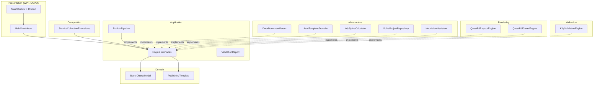
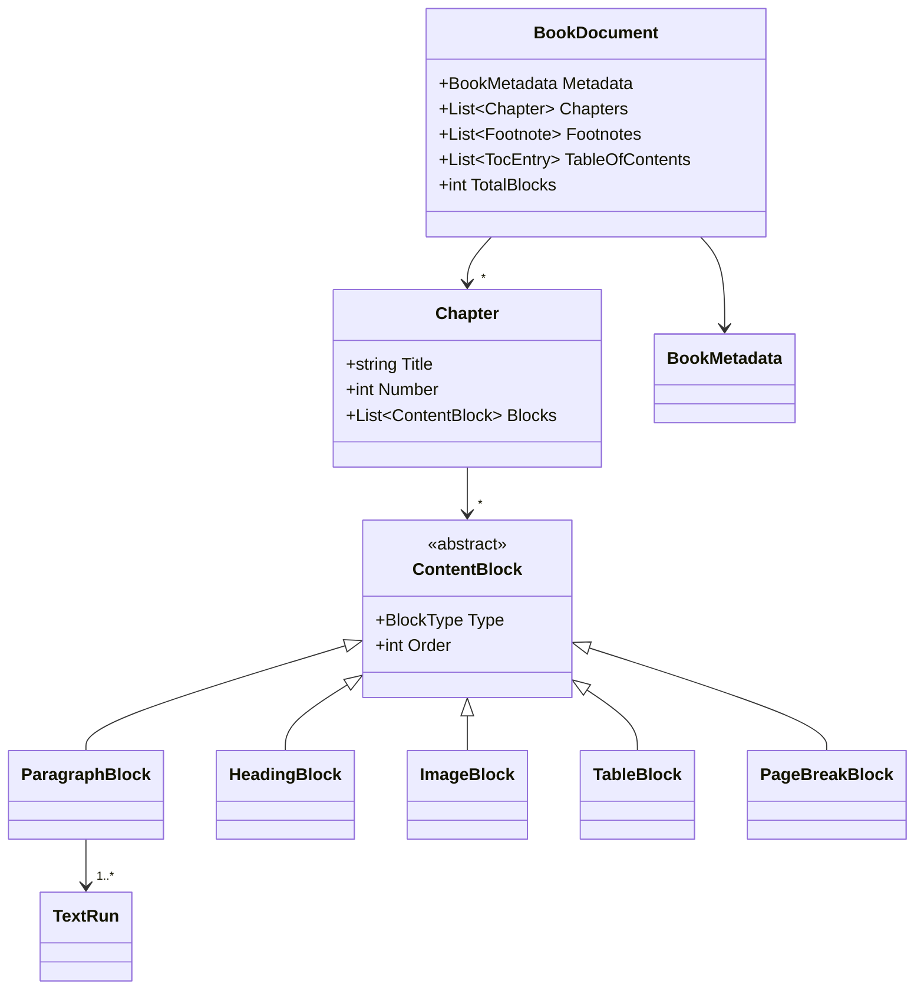
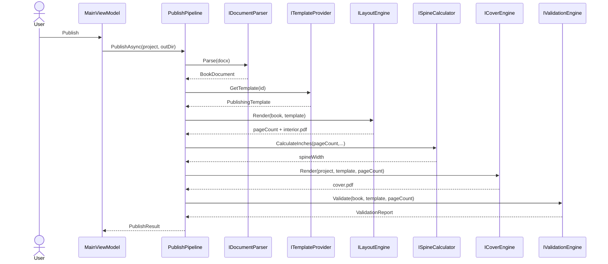

# Architecture

Anay Publisher Studio follows **Clean Architecture**. Dependencies point
inward: the UI and infrastructure depend on the application/domain, never the
reverse. Every engine sits behind an interface declared in the Application
layer, so implementations are swappable via dependency injection.

## Layer / component view

## Core domain class model

## Publish sequence

## Design principles applied
- **SOLID** - each engine is a single-responsibility class behind an interface.
- **Dependency Inversion** - Application defines contracts; Infrastructure /
  Rendering / Validation implement them; Composition wires them.
- **MVVM** - the WPF view binds to `MainViewModel`; no publishing logic in the UI.
- **Repository pattern** - `IProjectRepository` abstracts SQLite persistence.
- **Open/Closed** - new platforms are new template folders + (optionally) new
  engine implementations; existing code is untouched.

## Extended engines (this completion phase)
- `IProfessionalLayoutEngine` / `ProfessionalLayoutEngine` — composition document
- `ILivePreviewEngine` / `LivePreviewEngine` — layout-backed preview
- `ICoverDesigner` / `CoverDesigner` — layered cover design
- `IArtifactExporter` / `ArtifactExporter` — multi-format export
- `ITemplatePackageService` / `TemplatePackageService` — Template SDK
- `IPluginManager` / `PluginManager` — dynamic plugins
- `IParagraphComposer` / `IHyphenationService` — typography composition

All remain behind Application abstractions; Composition wires implementations.
Author content integrity remains mandatory on every export path.
