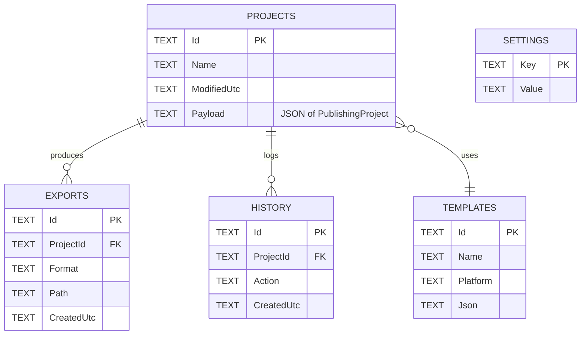

# Database Design (SQLite)

The desktop app persists projects and app state to a local SQLite file
(`%AppData%/AnayPublisherStudio/projects.db`). The current build ships the
`Projects` table; the remaining tables are the planned schema.

### Implemented
- **Projects** - `Id`, `Name`, `ModifiedUtc`, and a `Payload` column holding the
  serialized `PublishingProject` graph. Recent-projects queries order by
  `ModifiedUtc DESC`.

### Planned
- **Templates**, **Exports**, **History**, **Settings**, plus `Books`, `Fonts`,
  `Images` caches as described in the specification.
